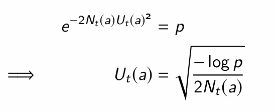
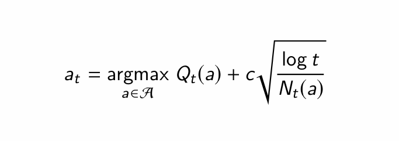
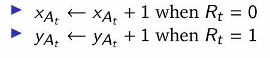
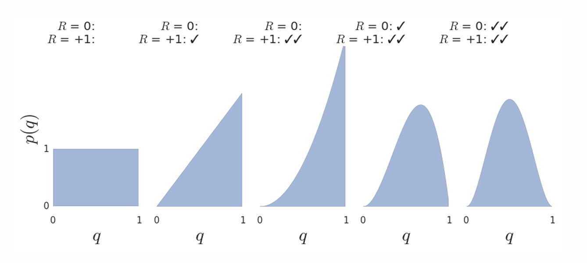
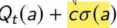
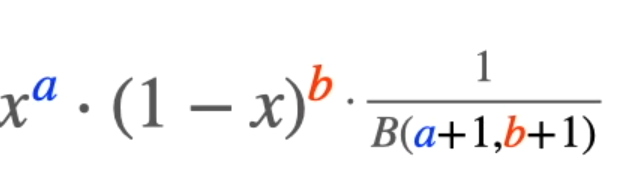
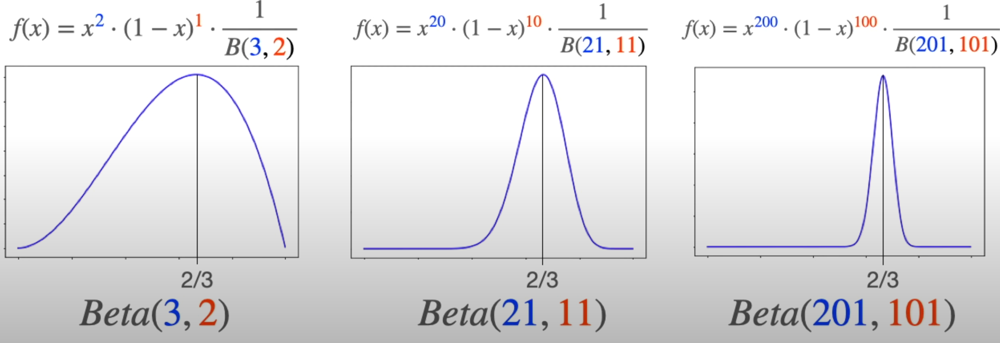
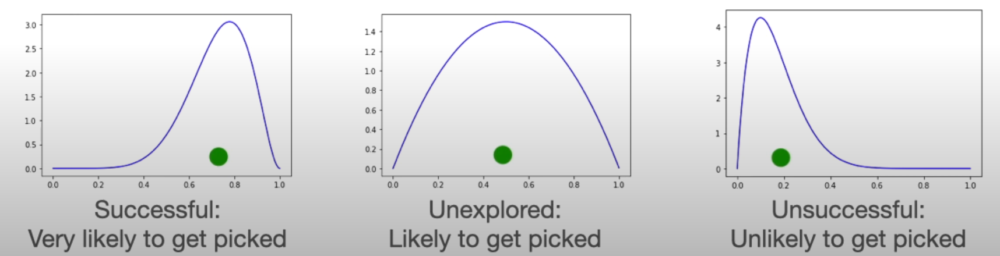

## Deriving an optimal bound

we want to act in the face of uncertainity. 
we always want Q(a) + U(a) >= q(a) (we are being optimistic)

Q(a) is the sampled value
q(a) is the true value

According to Hoeffding's Inequality

let, here the max probability that Q + U <= q is p.
and probability that Q + U > q is (1 - p)

we want this 1 - p to grow over time, i.e 
we want to become more confident that Q + U is greater than true mean over the time. 

We can pick a maximal desired probability p that upper bound doesn't exceed the true value and solve for Ut(a)

put 1/p = t, where t is the time. 

Now UCB becomes. 

U will be larger for smaller Nt(a), meaning we will explore if the given action is not tried much. 
as time increases log(t) will also increase logarithmicly, this ensures we are always exploring and also increasing confidence i.e (1 - p) that is, we are above true mean. 

for c = root 2, it gives logarithmic total regret. (how?)

---

## Bayesian Bandits

Each action ko expected value distribution chain track garne. 
we will first assume what the expected reward will be then update it over time.
i.e our belief of expected reward. 

we can model distribution as p(q(a) | theta)
where theta can contain mean and varience of the gussian  belief distribution

we can inject reach knowledge if we already know something as theta_not. 

Assume posterior as Beta distribution as Beta(Xa,Ya), initially Xa = 1, Ya = 1
Update posterior as

first ma reward 1,1 matra aauda kheri, expected reward 1 tira align vako theyo
tespaxi feri reward 0,0 aayo
now it make normal gussian distribution where expected reward is max at 0.5
in this way we update belief about true expected reward distribution with each iteration. 

Bayesian bandit with upper confidence bounds. 
pick action which maximizes 

That is jasko ko standard deviation of q(a) badi xa, teslai ni importance dim na. 

Beta distribution

->  probability distribution of the probability

if we win a times and loss b times, beta distribution is given as:

eg: we won 1) 2 times from 3, i.e p = 2/3  2) we won 20 times from 30, i.e p = 2/3
3) won 200 times from 300, i.e p = 2/3
here eventhough probability are same, for third case, the pobability graph will be steeper(meaning we are confidence that true distribution lies around 2/3, as we have many data to backup this)

Thomspons sampling
if we have many one-arm bandit, and we don't know its true underlying distribution, 
then what to choose?
say we have 3 machines
first make all machines beta distribution as Beta(1,1)

now Use this simple algorithm. 
1. sample from the beta distrubtion of all machine
2. jasko badi value aayo, select that machine to act.
3. Act on that machine, you will get the result
4. update the beta distributation of that machine based on the resut
5. Repeat. 

yeso vayesi, unexplored machine ko distribution wide hunxa, so thulo value ni select huna sakyo, so select huna payo
steper distribution xa vane, ramro values vayeko matra select hunxa. 
naramro values select hunna. 

---

## Information State Space

--- 

## Bernoulii Bandits

---

##  