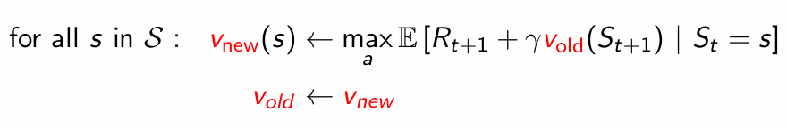

## MDP 

In mdp state s contains all relevant information to make decisions

Hence history can be thrown away or not needed

Connection between value function and state action value

sum the state action value weighted by the probability of taking that action

optimal value function -> max value function over all policies. 

Theorem:

1. There exists an optimal policy that is better or equal to all other policies
2. All optimal policies achieves optimal value function
3. All optimal policies achieves optimal action value function

If we have optimal action value function, we can have optimal policy

just take action which leads to highest action value

 
---

## Bellman Equations

value function and state value function can be written recursively

Sum (r + gamma*v(s')) weighted by every possible transitions p(r,s' | s, a) * 

weighted by taking that action pie(a | s)

First action ko probability ani tespaxi transition ko probability, dubai hunu paryo

so mulitply

similary for action values

same value function ko jastai equation ho

convert v_pie(s') to q_pie(s',a') by weighting over action and

we don't have to weight over action in front, becuase action is fixed or already choosen in action value. 

__Bellman's Expectation Equations__

__Bellman's Optimal Equations__

Instead of weighting over actions, take max over actions

---

## Bellman's Equation in Matrix form

Here v is the value function of all possible states [v[s1], v[s2], .... ]^T

r^pie = expected immediate reward following policy pie

p^pie = state transition matrix under policy pie

it's a linear equation, can be solved directly for small problems

Example for a uniform policy with 2*2 matrix where goal is on buttom right.
we can solve as

## Dynamic Programming

Collection of algorithms which can be used to compute optimal policies given the perfect model of the environment as MDP

Consists of 

1. Policy Evaluation
2. Policy Improvement

## Policy Evaluation

Algorithm

Acting greedily on the value of uniform policy can give optimal policy, but not always.

What we can do is

1. Evaluate policy of some uniform policy
2. you will get relatively good value function (after doing evaluation)
3. Now make new policy from the evaluated value function
4. Now evaluate this new policy
5. Repeat (in this way we reach optimal policy)

v_pie_new(s) >=  v_pie(s), for all s. so our value function and policy becomes better with each iterations. 

up arrow is evaluation

down arrow is greedyfication

We can repeat evaluation and greedyfication improving each time to reach optimal policy. 

---

Does it require to iterate up to true v^pie for each evaluation steps?

This is very computationaly heavy as, it requires many iterations at each evaluation

Turns out we can the just evaulate for 1 iteration and we still can get optimal value function

it's call value iteration

For simple deterministics world

it's simply V_k+1(s) =  R_t+1  +  max(over a) (gamma * V_k(St+1))

Here we are doing evaluaton and greedification at the same time, i.e at one step

## Synchronous value iteration 

Yesma V_new ra V_old dubai save garnu parxa

## In-place value iteration

Yesma just one copy matra rakhe hunxa, maile code ma gareko jastai, already updated value ni use garna payo. 

converge hune raixa asari ni. 

## Prioteorized sweeping

Jun state ma Bellman's error badi xa tei select garne, ani update garne

Hamro Standard DP le full width backup use garxa, 

tara if state-space ekdam thulo xa vane it is not possible

even for one full backup (i.e looking all the actions and states). 

so use Sample backup

It's model free, i.e no advance knowledge of MDP is required. 

