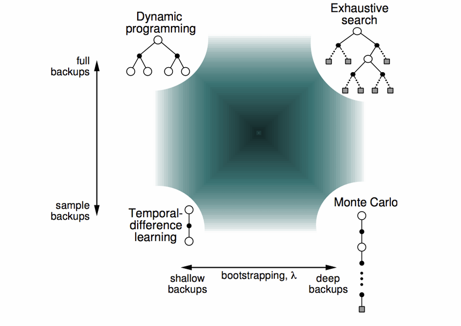

## Model Free Prediction

--- 

model free prediction to estimated values in an unknown MDP

model free control to optimise value in an unknown MDP

Monte carlo algorithms uses sample to learn and it don't need model

One episode sample = Monte carlo

if bandit depends on state too, we call it contextual bandit | episode length is still 1. 

so G_t+1 = R_t+1 (convention, paile R_t theyo)

## Value Function Approximation

table won't work for Larger MDPs so use functions to generalize for unsampled states.

Here, v_w(s) is a function which takes state as input and give output based on the parameters w, this can be learned. 

v_pie(s) is stored table value. 

w can be learned by MC or TD learning. 

If the env is not fully observable, we have to learn transition function too. 

Update agent state with this transition function

## Using Linear Approximation

Do this:

1. Convert state s_t to features x_t
2. Now predict value using linear combination of this features with weight
3. Now find error as (Target - predicted)^2
4. Update the weight

we are representing state by the feature vector

x : S -> R^m is a fixed mapping from agent state to features (eg: configuration in the chess)

Target: 

Loss: 

Update:

linear update = step_size * prediction_error * feature_vector

Similar update for state-action value

Loss and gradient update:

As, gradient of the action value at time t, is the feature of the state at time t. (becuase we assume linear approximator)

so update rule changes to:

Linear Update = step_size * prediction_error * feature_vector
Non-Linear Update = step_size * prediction_error * gradient

## Disadvantage of monte carlo

1. we are using episode returns to update the reward, which means it can take longer to update if the episode is long

2. Return can have high variance

---

## Temporal-Difference Learning

Monte-carlo ma update value towards the sampled return 

But in TD-learning we update value towards the estimated return

Updates in each methods

1. DP

Just go one-step far and take average of the estimate

Here black is action taken, action is stochastic so we can get diff states

2. Monte-Carlo

Do this

- sample 1 full episode
- get Gt
- update value towards Gt

3.TD Learning

- just go one step
- compute TD error
- update towards TD error

## Bootstraping

bootstraping means update involves estimate (i.e using value estimator as target)

DP - yes

MC - no

TD - yes

## Sampling

update is done by sampling an expectation

DP - no

MC - yes

TD - yes

TD is similar for action-value

TD is model free, we can learn direcly from experience

we can learn from incomplete episodes

## Advantage of TD over MC

1. It can learn before the final outcome | or without final outcome
2. TD is independent of temporal span of prediction | hamro MC le ta last ma update garne ho so yeslai sabai steps ko prediction save garera rakhnu paryo -> this requires large memory if the episode is large | tara TD le ta each step ma update garxa so this is pure computation

3. But TD needs good value estimator otherwise it don't work well

Changes recommended by the monte carlo error is:

Every prediction at each state will go towards (Gt or actual return)

Changes recommended by the TD methods is:

T.D error le prediction gareko value pati update garxa, each state ko values haru lai

## MC and TD comparision

1. MC offcourse gives unbaised estimate of V_pie(st) | TD gives biased estimate i.e 

R_t+1 + gamma*V_t(S_t+1)

2. offcourse high variance for MC  | Actual return ta many random actions,reward ma depend garxa, but td error leta just one random action, transition, reward ma depend hunxa so yesko low variance hune vayo

Random Walk example analysis for TD and MC

1. For TD optimal alpha = 0.1
2. For MC optimal alpha = 0.03
3. For big alpha there is high variance in MC
4. Relatively TD error gives less error here
5. MC ma ali thulo alpha vaye error fast ghatyo, tara feri ekdam fast stable hune  raixa (thulo error ma nai), high variance hune raixa

## Batch MC and TD

Consider a batch of experiences

now iteratively sample 1 episode k belongs to [1,k] and apply MC or TD

This is sampling from the empirical model 

## Problem

My analysis

1. 6 out of 8 times in B, we get reward of 1 
2. It seems env always terminated after taking action at B
3. From the given sample, Value at state B may be around 6/8 i.e 0.75

4. for state A, there is just one episode sample from the A
5. Its tranisiton is always at B and its get rewad of 0
6. After state B also it gets reward of zero

7. Now there may be two cases: agent normaly went to B from A, and there it got reward of 0. (which is possible for B)
8. or it may be the case that, if agent start from A, it always gets 0 rewad at B

9. so it's hard to approximate the value at A

10. it can be either 0 or >= 0.75  (it will surly reach B which itselves have value 0.75 + it may gain some reward going to B)

Difference in Batch solutions

1. MC

MC converges to the best mean-squared fit for the observed return

This is sabai batch ko, each timesteps ko MC error ko sum. 

For MC,   V(A) = 0

Because,  MC sees how much average actual return it got starting from A. 

we have just one episode or example starting from A and it got 0 return in that episode so 

V(A) = 0 for MC

for T.D   V(A) = 0 + V(B)

V(A) = V(B) = 0.75

Analysis

1. MC assums the state B we got from A, different from other state B
2. TD error offcourse utlizes the all available samples/data

TD converges to the solution of max-likelihood markov model

Use data -> make emperical MDP -> make decisions

p(S_t+1 == B | St == A) = 1, so V(A) = V(B)

M.C vs T.D

1. TD exploits markov property
2. MC doesn't exploits markov property

Unified view of reinforcement learning

MC sees all steps reward and TD sees just one step reward
what if we see n-steps reward?

Use n-step return and update with mulitstep temporal difference learning, very simple

In TD information backpropagate slowly
In MC information backpropagate faster | tara offcourse update noiser hune vayo

2nd picture uses 1-step TD

If agent is deploy to env again, it doesn't have any information and again acts randomly, except if it reach near the goal, it will be baised towards reaching that goal

3rd picture uses 10-step learning

Here not only values near the goal states are update but also states farther from the goal

Now in the sucessive iterations agent behaviour will not be that random, it will be baised towards taking the action if it reach those update states

Ata n thulo banaye, aplha ghataunu parne raixa, for optimal performance

Ani n = 4 and alpha = 0.4 le ramro performance gari rako xa

This means, look atleast n steps from time t, and then do bootstraping

We can bootstrap littl bit on mulitple state

derive to:

it's the weighted sum of each state, up to inf

if lamda = 0, we get TD and if lamda = 1, we get MC

1. alpha should be decreased if we increase lamda
2. we can see lamda is slightly better than n here
3. n = 4 seems similar to lamda = .8 | and they also need same alpha

Relation between lamda and alpha

n = 1/1-lamda

if lamda = 0.9, we get n = 10 | seems similar in the graph i.e lamda = 0.9 and n = 10

## Benifits of multi-step learning

1. We get benifits of both MC and TD i.e good bias and low variance
2. Intermediate value of n and lamda are good i.e n = 10 | lamda = 0.9

---

## Eligibility Traces

(not fully understood)

muliti-step returns are not independent of span so it is still computationally heavy
How to make it independent?

1. First write MC error as sum of td errors

Now we do update in MC as

Accumulating a whole episode of the updates:

e_t = eligibility trace

