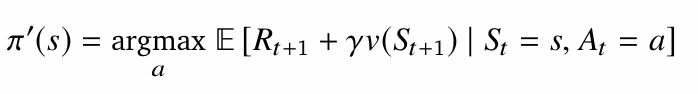
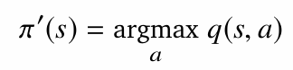
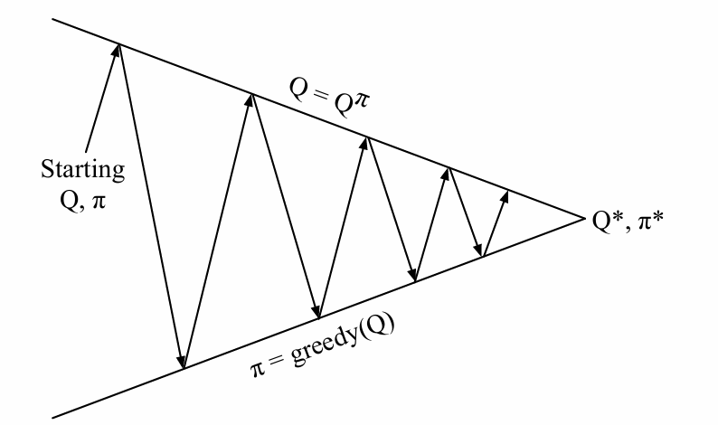
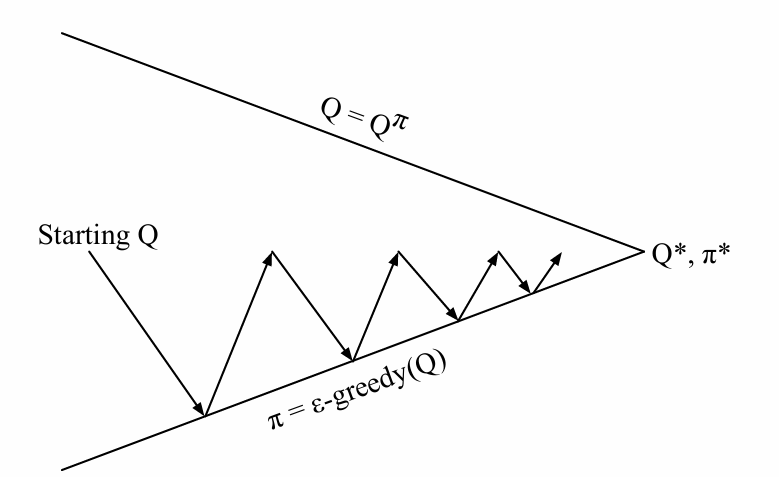
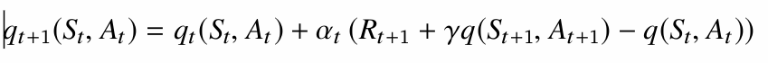
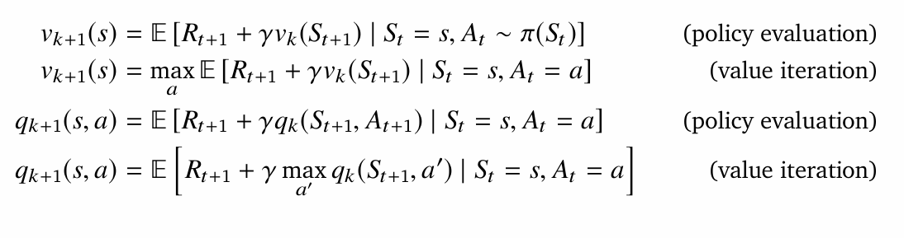
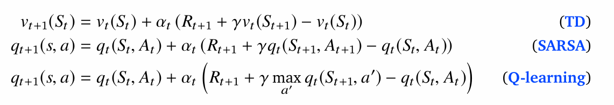
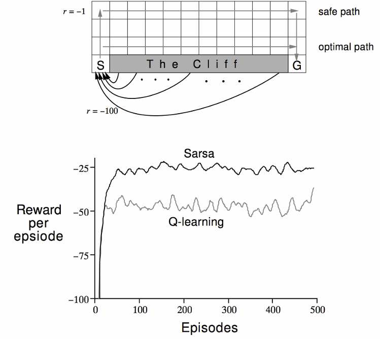

optimize the value function of an unknown MDP

aba greedification garera policy nikalnu paryo from the evaluated value function

1. Greedy policy improvement over v(s)

Here we need make policy goes to that state, which gives max values.

but for that we need the model of MDP, which we don't have

so we can use greedy policy improvement over q(s,a)

Here for policy evaluation we can use MC,

but for policy improvement, always doing greedification may not be the best case. 

because we need exploration too, to explore or sample all (s,a) pair

we can use epsilon greedy improvement

for every episode we can use
1. MC for policy evaluation and
2. e-greedy for policy improvement

---

## Temporal-Difference learning for control

1. evaluate policy using TD
2. policy improvement using e-greedy

Updating action value function using sarsa

## off-policy TD and Q-learning

we can make many analogous model free td algorithm from sampling the dynamic programming algorithms

from this dynamic programming algorithms, the sampled td algorithms are:

Here Q-learning is the sampled version of the state-action value iteration

we can't sample 2nd value iteration because expection is over actions, so we can't do that because we don't have mdp model (this may be wrong, think)

on-line learning -> pie is update and experience is sampled from pie
off-line learning -> target policy pie is updated and experience is sample from meu

---

## clif walking example

Here Sarsa seems to get more reward per episode than Q-learning

Here what happened is
1. Sarsa knows it actions are sometime random because we are using e-greedy, this makes very risky to walk near the clif, because one random action may make agent fall and gain negative reward, so it goes farther than optimal path, (which is walking near the clif). 

2. Q-learning don't know it is getting some random actions, so it follows the optimal policy, that is walking near the clif. 

3. But Q-learning is getting less reward because, it is falling into the clif while following optimal policy because of randomness in the action. 

4. but if we run the trained model greedily, Q-learning will have high reward than sarsa because there would be no random action

