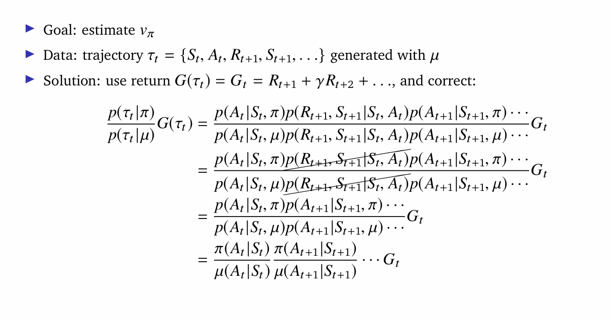

optimize the value function of an unknown MDP

aba greedification garera policy nikalnu paryo from the evaluated value function

1. Greedy policy improvement over v(s)

Here we need make policy goes to that state, which gives max values.

but for that we need the model of MDP, which we don't have

so we can use greedy policy improvement over q(s,a)

Here for policy evaluation we can use MC,

but for policy improvement, always doing greedification may not be the best case. 

because we need exploration too, to explore or sample all (s,a) pair

we can use epsilon greedy improvement

for every episode we can use
1. MC for policy evaluation and
2. e-greedy for policy improvement

---

## Temporal-Difference learning for control

1. evaluate policy using TD
2. policy improvement using e-greedy

Updating action value function using sarsa

## off-policy TD and Q-learning

we can make many analogous model free td algorithm from sampling the dynamic programming algorithms

from this dynamic programming algorithms, the sampled td algorithms are:

Here Q-learning is the sampled version of the state-action value iteration

we can't sample 2nd value iteration because expection is over actions, so we can't do that because we don't have mdp model (this may be wrong, think)

on-line learning -> pie is update and experience is sampled from pie
off-line learning -> target policy pie is updated and experience is sample from meu

---

## clif walking example

Here Sarsa seems to get more reward per episode than Q-learning

Here what happened is
1. Sarsa knows it actions are sometime random because we are using e-greedy, this makes very risky to walk near the clif, because one random action may make agent fall and gain negative reward, so it goes farther than optimal path, (which is walking near the clif). 

2. Q-learning don't know it is getting some random actions, so it follows the optimal policy, that is walking near the clif. 

3. But Q-learning is getting less reward because, it is falling into the clif while following optimal policy because of randomness in the action. 

4. but if we run the trained model greedily, Q-learning will have high reward than sarsa because there would be no random action

---

## Overestimation in Q-learning

ata q-learning le select garna ra evaluate garna  same values use gareko xa i.e qt

yeso garda chain, seleted values chain over-estimated values haru hune raixa

Solution is decouple selection from evaluation

Double Q-learning

2 values function store garne, euta le action select garne ani aarko le update

Here we are updating q_t(S_t,a)

SARSA can also over-estimate so we can use double SARSA

---
## Importance Sampling

Say we need find the expectation of f(x), where x is sampled from distribution p. 

so it is integration of f(x)*p(x)

but as x space can be very large, it's impossible to do so,  so

let's use monte carlo sampling

that is sample x, n times and find 1/n(f(x))

Now, say we do this multiple times and get many expectations. 

we can see this expactations varies, and creates a normal distribution

and actual expectation is the mean of this normal distribution. 

more we find the expectation, more we create the accurate normal distribution. 

One thing is, it's varience is exactly the varienace of the f(x) scaled by 1/N. 

but one problem is this method can give high variance, so the solution is 

Importance Sampling. 

Here we hope to reduce the variance. 

take another distribution q, and sample from this find the expectation of f(x) over p. 

But p and q are completly different, how sampling from q, find the expectation of f(x) over p?

they are not quite different, we choose q to have higher density

where |p(x)*f(x)| have higher values. 

In this way we can guess correct expectation with (still  unbaised estimate which is good) and a low variance which is also good. 

we can see we get more stable expectation with this method. 
that is sampling x from q, and finding 

---

## off-policy learning

In off-policy learning we use policy meu to collect data and our aim is to update or learn the policy pie. 

Say we want to find the expected reward Rt, given state = St and action At which is sampled from pie.

which is this equation,   But

we don't want to select action from the pie distribution,we want to select from meu distribution in the off-line learning. 

That means we want to find the expected reward Rt which was gotten by following pie, but we want to find exact same value but by following meu. 

Hence Importance sampling comes into play.

sample from meu but weight it by pie(At|st)/meu(At|st), you will get the unbaised estimates

Here we are sampling a from meu, see

These LHS and RHS is exactly the same. (amazing)

---

## Importance Sampling For Off-policy Monte-Carlo

Here we want to estimated V_pie, but the trajectory is collected using meu

1. find return of the trajectory G(tau)
2. As this is not the return following the policy pie
3. we need to correct it as P(tau | pie)/p(tau | meu) * G(tau_t)

---

## Importance Sampling for Off-policy TD updates

hamro targets chain meu le generate vako hunxa, (vaneko st+1 chain action a lera pugeko ho, which is sampled from meu) so teslai matra correct gare vayo

1. lower variance hunxa monte-carlo importance sampling vanda
2. Policy only needs to be similar over a single step (what??)

proof:

we can see sampling from meu with correction is same as sampling from pie without correction (easy)

## Expected SARSA (general q-learning)

confused little

