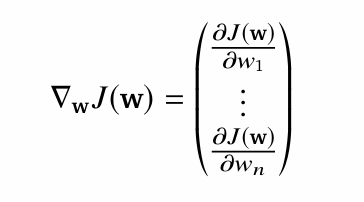
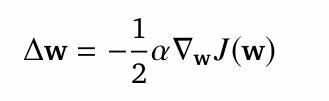
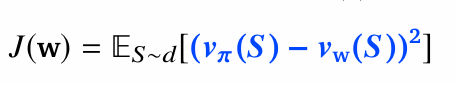
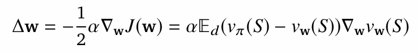
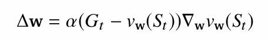
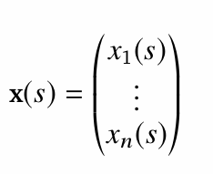
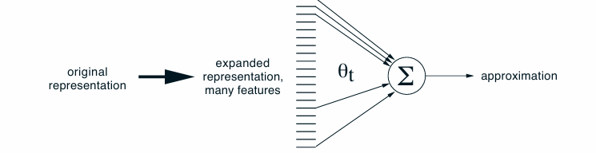
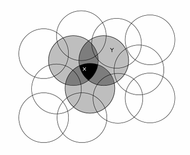
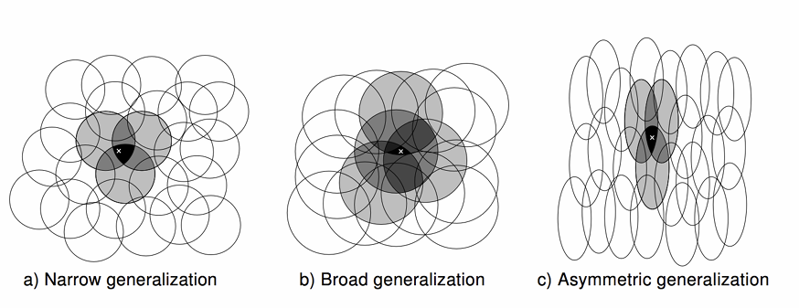

## value function approximation

problems:

1. to many states
2. so slow to learn each states values

## value function approximation

Make function with parameter w, which takes observation as input and output 

the value function. 

Now we need to have correct parameter w, which maps to correct values for each state

Update parameter using MC or TD learning

Hopefully now generalizable to unseen states. 

## Agent state update

If the env is not fully observable, we need to have an agent state, 

which acts like a memory and remembers the past observations it saw. 

Agent state should constantly changes with exploration. 

new_state = function(s_t-1, A_t-1, O_t)

This function parameter can also be learned.

---

## classes of function approximation

Tabular ma sabai states save hune vayo, state aggregation technique ma chain contineous states lai segment manne, ani tyo segment bata just 1 ota matra discrete state line, yeso vayesi inf state problem ni thorai solve vayo ani halka generalizeable ni vayo,  yesko one assumption is najik, najik ko states similar hunxa. 

In linear approximation function, we consider fix agent update i.e S_t = O_t, and we map state S_t to R^n (fixed features map).  we use linear combination of this features to approximate the value function. 

i.e V_w(S) = W^T * x(S)

State aggregation and tabular are the special case of the linear approximation function. Eg: we can consider features as one-hot vector in tabular case. s1 = [1 0 0 0... ], s2 = [0 1 0 0 0 ....]

In differentiable function approximation we approximate value using function
V_w(s) which is parametarized by w. where V_w(s) is differentiable and can be non-linear. Eg: CNN where the features are not fixed but learned. 

---

## Gradient Based Algorithms

parameters needs to be updated so that our functions can approximate accurately with time. 

let J(w) be the differentiable function we want to minimize, here this functions are made such that, minimizing this makes our approximate lesser error prone, making better approximations

now, we need to find such w(parameters) which minimizes J(w), meaning we need to go towards the global minima of the function J(W), i.e move towards the negative of the gradient. (simple)

i.e we do gradient descent. 

1. Find gradient of J(W)

2. now updates the parameters(w)  towards the negative gradient,  (make small update)

---

Now approximating values by using stochastic gradient descent. 

1. Define J(W)

(taget - prediction)^2

2. descent the gradients

W_new = W_old + del_W

3. As there is expections, let's sample the gradient (hence stocasticsity is introduced)

---

## Linear Function Approximations

Here we represent state by feature vector, there is a fixed mapping from the state to the feature vector. 

Example feature vector is piece and pawn configuration in chess. 

One of the ways to convert state to features is coarse coding. 

yesma chain large feature vector ma lane re, hamro state lai, teta bata approximate garne (too vauge)

lets consider points in 2d space as a state, then we have feature constructor like this, where higher concentration is in the point state located on, and it's density decreases with distace. 

Here if the state lies in x, those three circle can have 1 values and all other have zero. 
x = [0 0 0 1 1 1 0 0 0 ...], this way. 
or it could be contineous, which is better

x = [0.1 0.2 0.5 0.8 0.5 0.2 0.1 ...] this way

Resulting feature vector/agent will be non-markovian (no idea how)

if the updates are very specific to the local region, then agent wouldn't know the transition from one region to another region, if it pass 2 local region, hence non-markovian  (no idea, what this mean)

