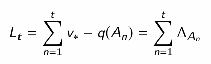
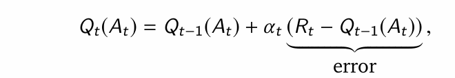
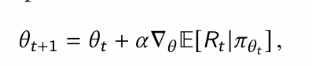
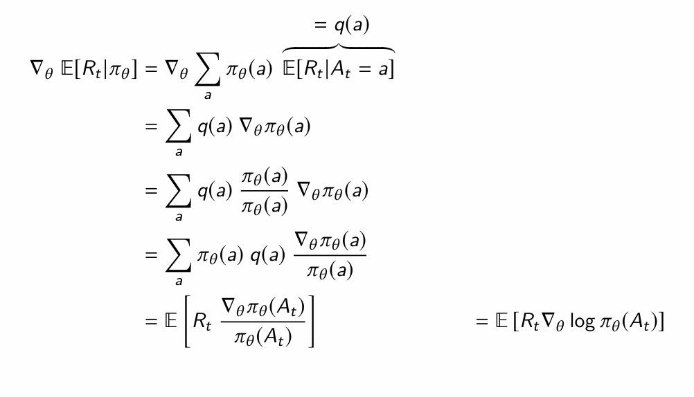
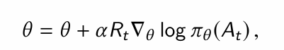
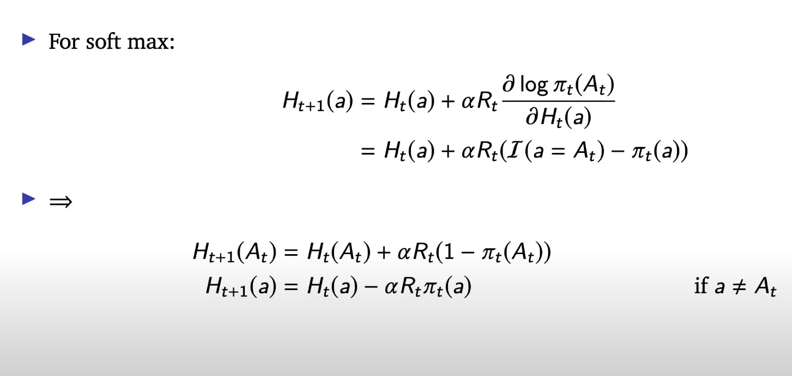
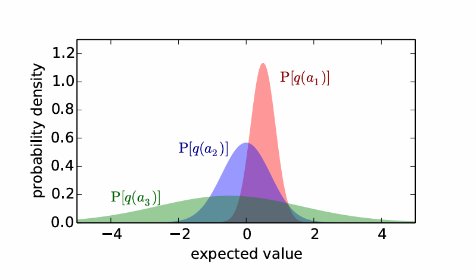
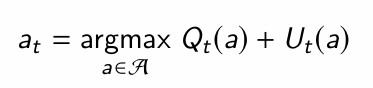

<!-- Exploration and Exploitation

explore - increase knowledge
exploite - maximize performance based on accuired knowledge

hamro optimal value >= any value at each time step.  (kinaki yesle future ko ni account garxa ni ta, or nagareni true)
so in multi-arm bandit setting, goal is to minimize total regret

Action value
-> q(a) = expected reward Rt given action At = a. 
1 estimation can be average of previous rewards given At = a. say Qt(a)

now Qt(At) can be defined recursivly
let n = N_t-1_(At)
Qt(At) = (n*Q_t-1 + Rt) / n+1
       = (n*Q_t-1 /n+1)  + Rt/n+1
       =  ..               + (Rt - Q_t-1 + Q_t-1)/n+1
       = Qt-1(n+1)/n+1 + (1/n+1)(Rt - Qt-1)
       = Qt-1 + alpha*(Rt- Qt-1)

can be thought as adding or subtracting on our previous expected value based on error and the learning rate, 
here learning rate decreases with time. 

Algorithms 
1. greedy
- selects action with highest value
- can stuck in suboptimal action
2. epsolon greedy
- with prob e, explore
- with prob 1-e, take action with highest value

Policy gradients 
learning policy directly
make a neural network with parameters theta to predict the actions.
update parameters such that the expected reward is increased. 
i.e gradient ascent

using log-likelihood trick, we can compute the gradient. 

vector (gradient of log_pie_theta(At)) points in the direction where action At increases. Aba weight it by 
reward Rt. ramro action xa vane tesko probability badi badxa, ramro xaina vane kam. 
tara jaile kina badaune ra? no scale garda ghatna ni sakyo

now we can get Rt for initial At, by acting in the environment and can update

we can similarly update action preference

preference for the selected action will be increased and other other will be decreased. 
or preference for the selected action will increase more. 

tara, unselected action ko reward ni high ani pie_t(a) ni second highest vaye, R*pie_t(a) ta highest hola ni, ani yesko action ghatxa. teso vayo kasari learn garna sakxa ramro sanga?

Importance of baseline

we can subtract baseline b from R as (Rt - b) in policy gradeint equation. 
this doesn't changes expected direction of the gradent, but do changes the variance, which helps to improve the performance. 

Optimism in the face of uncertainity
if kunai action ko value chain uncertain xa vane, let's be optimistic about the value of that action. 
so yeslai badi explore garum. 

Here we are more uncertain about the action 3, so it should be explore more. 
with time this distribution gets more narrower and stipper (i.e we are more certain)

Upper confidence bound

select action UCB

if Nt(a) is small, Ut(a) will be large, picking action a
if Nt(a) is large, Ut(a) will be small, action will be selected if it's value estimate is good. 

Deriving an optimal bound -->
# Exploration and Exploitation

explore - increase knowledge  
exploite - maximize performance based on accuired knowledge  

hamro optimal value >= any value at each time step.  (kinaki yesle future ko ni account garxa ni ta, or nagareni true)  
so in multi-arm bandit setting, goal is to minimize total regret  

---

## Action value

-> q(a) = expected reward Rt given action At = a.  
1 estimation can be average of previous rewards given At = a. say Qt(a)  

now Qt(At) can be defined recursivly  
let n = N_t-1_(At)  

Qt(At) = (n*Q_t-1 + Rt) / n+1  
       = (n*Q_t-1 /n+1)  + Rt/n+1  
       =  ..               + (Rt - Q_t-1 + Q_t-1)/n+1  
       = Qt-1(n+1)/n+1 + (1/n+1)(Rt - Qt-1)  
       = Qt-1 + alpha*(Rt- Qt-1)  

can be thought as adding or subtracting on our previous expected value based on error and the learning rate,  
here learning rate decreases with time.  

---

## Algorithms 

1. greedy  
   - selects action with highest value  
   - can stuck in suboptimal action  

2. epsolon greedy  
   - with prob e, explore  
   - with prob 1-e, take action with highest value  

---

## Policy gradients 

learning policy directly  
make a neural network with parameters theta to predict the actions.  
update parameters such that the expected reward is increased.  
i.e gradient ascent  

using log-likelihood trick, we can compute the gradient.  

vector (gradient of log_pie_theta(At)) points in the direction where action At increases. Aba weight it by  
reward Rt. ramro action xa vane tesko probability badi badxa, ramro xaina vane kam.  
tara jaile kina badaune ra? no scale garda ghatna ni sakyo  

now we can get Rt for initial At, by acting in the environment and can update  

we can similarly update action preference  

preference for the selected action will be increased and other other will be decreased.  
or preference for the selected action will increase more.  

tara, unselected action ko reward ni high ani pie_t(a) ni second highest vaye, R*pie_t(a) ta highest hola ni, ani yesko action ghatxa. teso vayo kasari learn garna sakxa ramro sanga?  

---

## Importance of baseline

we can subtract baseline b from R as (Rt - b) in policy gradeint equation.  
this doesn't changes expected direction of the gradent, but do changes the variance, which helps to improve the performance.  

---

## Optimism in the face of uncertainity

if kunai action ko value chain uncertain xa vane, let's be optimistic about the value of that action.  
so yeslai badi explore garum.  

Here we are more uncertain about the action 3, so it should be explore more.  
with time this distribution gets more narrower and stipper (i.e we are more certain)  

---

## Upper confidence bound

select action UCB  

if Nt(a) is small, Ut(a) will be large, picking action a  
if Nt(a) is large, Ut(a) will be small, action will be selected if it's value estimate is good.  

---

## Deriving an optimal bound

