## Model Free Prediction

--- 

model free prediction to estimated values in an unknown MDP

model free control to optimise value in an unknown MDP

Monte carlo algorithms uses sample to learn and it don't need model

One episode sample = Monte carlo

if bandit depends on state too, we call it contextual bandit | episode length is still 1. 

so G_t+1 = R_t+1 (convention, paile R_t theyo)

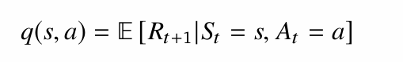

## Value Function Approximation

table won't work for Larger MDPs so use functions to generalize for unsampled states.

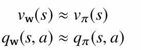

Here, v_w(s) is a function which takes state as input and give output based on the parameters w, this can be learned. 

v_pie(s) is stored table value. 

w can be learned by MC or TD learning. 

If the env is not fully observable, we have to learn transition function too. 

Update agent state with this transition function

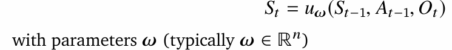

## Using Linear Approximation

Do this:

1. Convert state s_t to features x_t
2. Now predict value using linear combination of this features with weight
3. Now find error as (Target - predicted)^2
4. Update the weight

we are representing state by the feature vector

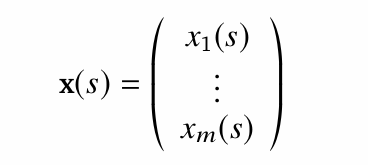

x : S -> R^m is a fixed mapping from agent state to features (eg: configuration in the chess)

Target: 

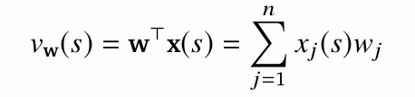

Loss: 

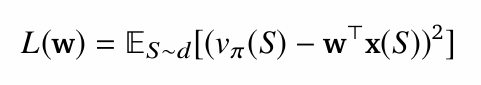

Update:

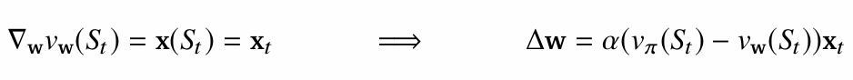

linear update = step_size * prediction_error * feature_vector

Similar update for state-action value

Loss and gradient update:

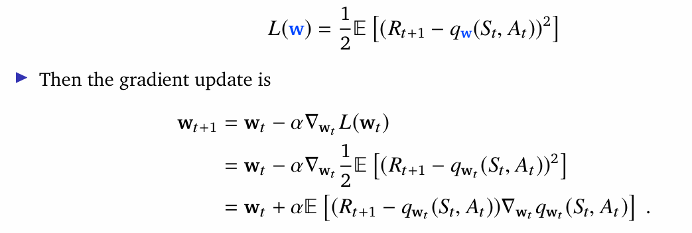

As, gradient of the action value at time t, is the feature of the state at time t. (becuase we assume linear approximator)

so update rule changes to:

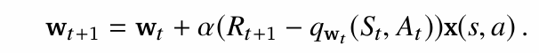

Linear Update = step_size * prediction_error * feature_vector
Non-Linear Update = step_size * prediction_error * gradient

## Disadvantage of monte carlo

1. we are using episode returns to update the reward, which means it can take longer to update if the episode is long

2. Return can have high variance

---

## Temporal-Difference Learning

Monte-carlo ma update value towards the sampled return 

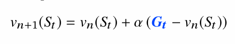

But in TD-learning we update value towards the estimated return

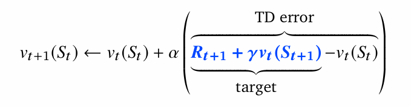

Updates in each methods

1. DP

Just go one-step far and take average of the estimate

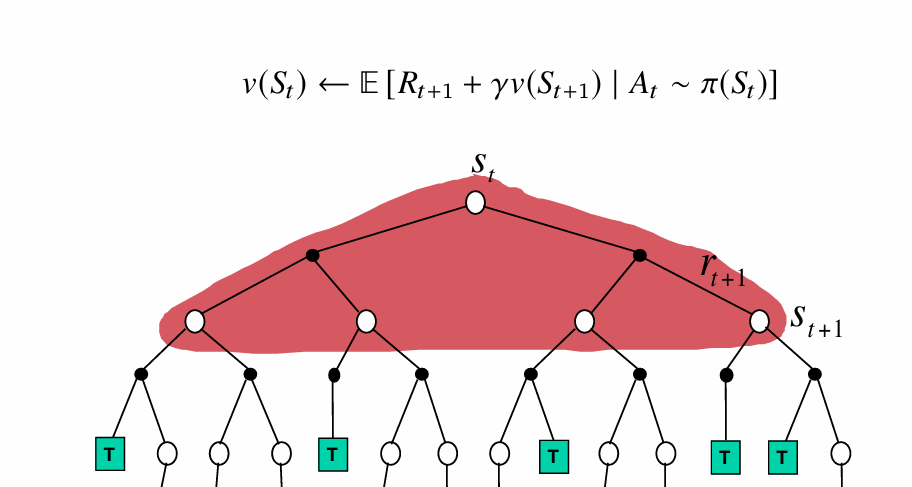

Here black is action taken, action is stochastic so we can get diff states

2. Monte-Carlo

Do this

- sample 1 full episode
- get Gt
- update value towards Gt

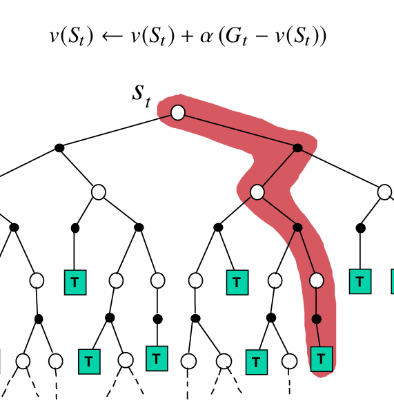

3.TD Learning

- just go one step
- compute TD error
- update towards TD error

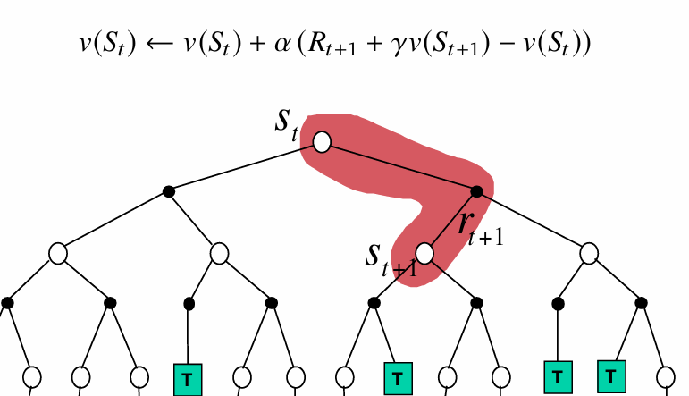

## Bootstraping

bootstraping means update involves estimate (i.e using value estimator as target)

DP - yes

MC - no

TD - yes

## Sampling

update is done by sampling an expectation

DP - no

MC - yes

TD - yes

TD is similar for action-value

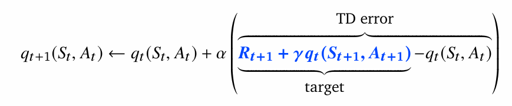

TD is model free, we can learn direcly from experience

we can learn from incomplete episodes

